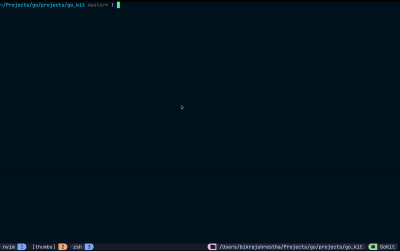

# go_kit

 

`go_kit` is a project that emulates a terminal environment by implementing some of the basic Linux command-line tools in Go. This project provides Go-based implementations for popular Linux commands, making it a lightweight yet powerful tool for CLI enthusiasts.

---

## Demo

Below is an example of `go_kit` in action:



---

##  Table of Contents

- [Installation](#installation)
- [Usage](#usage)
- [Features](#features)
- [Planned Features](#planned-features)
- [Contributing](#contributing)
- [License](#license)

---

##  Installation

Ensure you have Go installed (>= 1.20). Then, clone the repository and run:

```bash
# Clone the repository
git clone https://github.com/bikraj2/go_kit.git
cd go_kit

# Run the CLI
go run ./cmd
```

---

##  Usage

You can use the following commands in `go_kit`. Each command supports the `-help` flag for documentation:

```bash
<command> -help
```

Example:

```bash
gokit ls -help
```

---

## Features

| Command  | Description                       |
|----------|-----------------------------------|
| `ls`     | List directory contents          |
| `clear`  | Clears the terminal screen       |
| `cd`     | Change the current directory     |
| `color`  | Customize terminal colors        |
| `mkdir`  | Create new directories           |

---

##  Planned Features

- [ ] `echo` - Print arguments to output  
- [ ] `| (pipe)` - Pipe output from one command to another  
- [ ] `curl` - Fetch data from a URL  
- [ ] `grep` - Search for patterns in text  

---

##  Contributing

Contributions are welcome! To contribute:

1. **Fork** the repo
2. **Create a branch** (`git checkout -b feature-name`)
3. **Commit changes** (`git commit -m "Added new feature"`)
4. **Push to your fork** (`git push origin feature-name`)
5. **Create a Pull Request**

---

##  License

This project is licensed under the MIT License.

---

### ⭐ Show Some Love
If you like this project, give it a ⭐ on GitHub!
